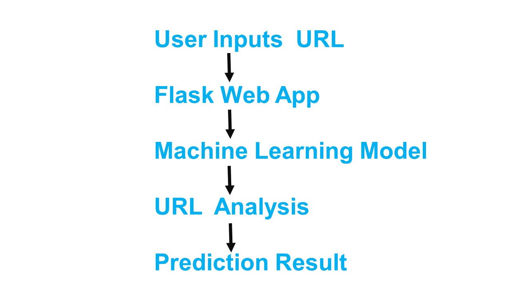
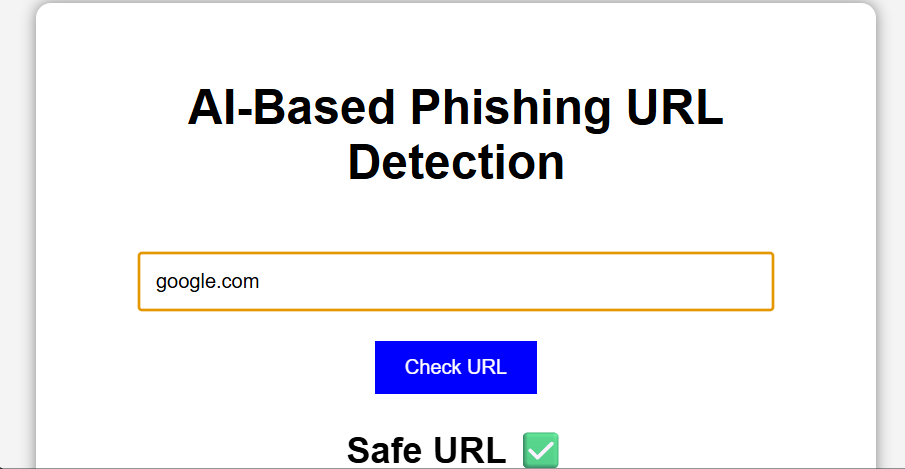

# AI-Based Phishing URL Detection System

A Machine Learning powered cybersecurity application that detects malicious phishing URLs and protects users from online scams.
## 📌 Product Overview

The AI-Based Phishing URL Detection System identifies phishing URLs using Machine Learning algorithms.
## 🌍 UN SDG Global Impact

### SDG 9 — Industry, Innovation & Infrastructure

### SDG 16 — Peace, Justice & Strong Institutions
## ✨ Features

- Detects phishing URLs
- Fast prediction
- User-friendly interface
- Cybersecurity awareness
## 🛠️ Technologies Used

- Python
- Flask
- HTML
- CSS
- Scikit-learn
## ⚙️ Installation Guide

```bash
git clone https://github.com/yourusername/repositoryname.git

cd repositoryname

pip install -r requirements.txt

python app.py
```
## 🧠 System Architecture


## 📸 Final Gallery


## 👨‍💻 Team Members

- Tisha Pore
- Baikan Ashritha 
## 📌 Conclusion

This project helps users identify phishing URLs using Artificial Intelligence.
